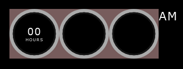
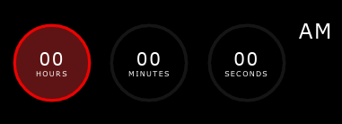
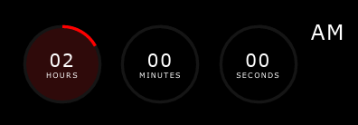
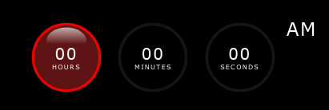
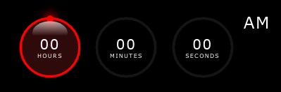

# css-svg-clock
## Analog-digital 3D clock using CSS/SVG/HTML/JS
<a name="top"></a>

The following tutorial helps to recreate the HH:MM:SS clock below, which then can be used on your next project page.


The basic idea come from [Online Tutorials](https://youtu.be/eoSfzVz9ur0) youtube page. I redesigned and added some extra features to the original work. Enjoy, and feel free to comment!

I'll try to follow the development - as it was happened at my desk - step by step, phase by phase with lot of comments, pictures, and code snippets. Some times I will give you some hints to be able to readjust or add more features to the design.

<a name="toc"></a>
<h2>Table of contents</h2>
<hr/>

- [1 Preparations](#1)

    - [1.1 Generate HTML file](#11)

        - [1.1.1 Basic HTML 5 skeleton](#111)

    - [1.2 HTML code of clock](#12)

        - [1.2.1 Add clock's container](#121)

        - [1.2.2 Add clock's gauges and AM/PM indicator container](#122)

        - [1.2.3 Add circles to clock' face](#123)

    - [1.3 The CSS file](#13)

        - [1.3.1 Create base layout](#131)

        - [1.3.2 Add time value text and unit indicators](#132)

        - [1.3.3 Add colors for gauges](#133)

        - [1.3.4 Add shining layer](#134)

        - [1.3.5 Add *dot* symbol to the gauges](#135)

- [2 Programming](#2)

    - [2.1 Collect clock' DOMs](#21)

    - [2.2 Collect clock' SVG elements](#22)

    - [2.3 The timer function](#23)

        - [2.3.1 Deal with the hours and AM/PM value](#231)


<hr/>

<a name="1">
<h2>1 Preparations</h2>
</a>

First of all create a project folder, then create ***css*** subfolder in it. Touch *clock.css* in the subfolder **css**, then touch *clock.html* or *index.html* or whatever html file you prefer in the project's root directory. See directory structure below:

```bash
ls -Ra css-svg-clock
..
.
css/
css/clock.css
clock.html
```

<a name="11">
<h3>1.1 Generate HTML file</h3>
</a>

<a name="111">
<h4>Step 1.1.1: create basic HTML 5 skeleton</h4>
</a>

First of all we create a basic HTML 5 file with all necessary elements in it.

```html
<!DOCTYPE html>
<html lang="en">
    <head>
        <title>CSS_SVG_Clock</title>
        <meta charset="UTF-8">
        <meta name="viewport" content="width=device-width, initial-scale=1">
        <link href="css/clock.css" rel="stylesheet">
    </head>
    <body>
        <!-- OUR CLOCK HTML CLODE GOES BETWEEN THESE COMMENT BLOCKS -->

        <!-- END OF CLOCK HTML CODES -->
    </body>
</html>
```

Every time I'm adding something into the clock's HTML code, they going to be placed between the two comment blocks.

[Back](#1) [Top](#top)

<a name="12">
<h3>1.2 HTML code of clock</h3>
</a>

<a name="121"></a>
<h4>Step 1.2.1: let's add div container for our clock</h4>

The ***div#time*** will contain our clock gauges and texts appear on our clock' face.

```html
        <!-- OUR CLOCK HTML CLODE GOES BETWEEN THESE COMMENT BLOCKS -->
        
        <div id="time">
        
        </div>
        
        <!-- END OF CLOCK HTML CODES -->
```

The ***#time*** div will contain our clock gauges and texts. This DOM element - with all its children - can be put into your page wherever you want - *and of course there's enough space to hold everything of the complete clock face*, all is up to you.

<a name="122">
<h4>Step 1.2.2: add three container DIVs for the gauges and one for the AM/PM indicator of the clock.</h4>
</a>

Our clock consists of three circle gauges with text inside of each, and a label representing 12 hours clock AM or PM depending on the hours value after or before noon (*or midnight*).

```html
        <div id="time">
            <!-- HOURS -->
            <div class="gauge">

            </div>
            <!-- MINUTES -->
            <div class="gauge">

            </div>
            <!-- SECONDS -->
            <div class="gauge">

            </div>
            <!-- AM/PM -->
            <div class="ampm">AM</div>
        </div>
```

<a name="123">
<h4>Step 1.2.3: add circles to each gauges - not for AM/PM indicator</h4>
</a>

We define a container box to achieve the overlapping SVG layers and centered text values in the area of each circles.
The ***.circle*** classed DIVs will contain gauge's SVG elements needed to draw our clock faces. Later we add another layer on top of ***.circle***, which will detail the shining 3D effect. Plus a toplevel layer for the text representation of the current time value with the proper unit indication as well.

```html
        <div id="time">
            <!-- HOURS -->
            <div class="gauge">
                <div class="container">
                    <div class="circle">
                        <!-- This block will contain SVG circles -->
                        <svg>
                            <circle cx="60" cy="60" r="50" id="face"/>
                            <circle cx="60" cy="60" r="50" id="hh"/>
                        </svg>
                    </div>
                    <!-- Shining layer later... -->
                    <!-- Texta layer for time values and unit strings later... -->
                    <div class="texta" id="hour">
                        00
                        <span>hours</span>
                    </div>
                </div>
            </div>
            <!-- MINUTES -->
            <div class="gauge">
                <div class="container">
                    <div class="circle">
                        <svg>
                            <circle cx="60" cy="60" r="50" id="face"/>
                            <circle cx="60" cy="60" r="50" id="mm"/>
                        </svg>
                    </div>
                </div>
            </div>
            <!-- SECONDS -->
            <div class="gauge">
                <div class="container">
                    <div class="circle">
                        <svg>
                            <circle cx="60" cy="60" r="50" id="face"/>
                            <circle cx="60" cy="60" r="50" id="ss"/>
                        </svg>
                    </div>
                </div>
            </div>
            <!-- AM/PM -->
            <div class="ampm">AM</div>
        </div>
```

This is the time for checkout ***css/clock.css*** file and setup our page/clock layouts.

[Back](#11) [Top](#top)

<a name="cssfile">
<h3>1.3 The CSS file</h3>
</a>

In this file we will control the display of the clock elements. Every DOM element will be packed into our **DIV#time** container. So, let's define it's style as follows...

<a name="131">
<h4>Step 1.3.1: we create our clock's base layout</h4>
</a>

```css
    /* Common part begins */
    * {
        margin: 0;
        padding: 0;
        box-sizing: border-box;
        border-collapse: collapse;
    }

    body {
        display: flex;
        align-items: center;
        justify-content: center;
        min-height: 100vh;
        font-family:Verdana, Geneva, Tahoma, sans-serif;
        font-size: 16px;
        font-weight: 500;
        letter-spacing: .1rem;
        background: rgb(0, 0, 0);
    }
    /* Common part ends */

    /* Clock specific part begins */
    #time {
        display: flex;
        /* gap: 10px; */
        color: white;
    }

    #time .gauge {
        position: relative;
        display: flex;
        width: 120px;
        height: 120px;
        align-items: center;
        justify-content: center;
        background: rgba(119, 92, 92, 1);
        /* background: rgba(119, 92, 92, 0); */
    }

    #time .gauge .container {
        position: absolute;
        width: 100%;
        height: 100%;
        display: flex;
        align-items: center;
        justify-content: center;
    }

    #time .gauge .container .circle {
        position: absolute;
        width: 100%;
        height: 100%;
        background: rgba(170, 170, 170, 1);
        /* background: rgba(170, 170, 170, 0); */
        border-radius: 50%;
        -webkit-border-radius: 50%;
        -moz-border-radius: 50%;
        -ms-border-radius: 50%;
        -o-border-radius: 50%;
        z-index: 10;
        stroke: rgb(21, 21, 21);
        stroke-width: 4px;
    }
    /* Clock specific part ends */
```

After this you should see the [following](#fig1) - *Figure 1* - page on your browser or preview window:


**Figure 1**: The base layout.
<a name="fig1"></a>


<a name="132">
<h4>Step 1.3.2: add clock default values to each gauges with default unit indicators</h4>
</a>

I will demonstrate this step through *HOURS* container only, the rest should be completed by following the settings applied at this gauge.

```html
    ...
    <div id="time">
        <div class="gauge">
            <div class="container">
                <!-- hours gauge -->
                <div class="circle">
                    <svg>
                        <circle cx="60" cy="60" r="50" id="face"/>
                        <circle cx="60" cy="60" r="50" id="hh"/>
                    </svg>
                    <!-- dot for hour pointer -->
                </div>
                <!-- hour gauge' shine layer -->
            </div>
            <div class="texta" id="hour">
                00
                <span>hours</span>
            </div>
        </div>
        <!-- remaining gauges here -->
        ...
        <!-- Finally the AM/PM box -->
        <div class="ampm">AM</div>
    </div>
    ...
```

Updating stylesheet with the following entries the page will look like [Figure 2](#fig2) the *CSS* contents:

```css
        ...
        #time .gauge .texta {
            color: white;
            z-index: 20;
            display: flex;
            flex: 1;
            flex-direction: column;
            align-items: center;
            justify-content: center;
            text-align: center;
            font-size: 1.5em;;
        }

        #time .gauge .texta span {
            text-transform: uppercase;
            font-size: .6rem;
            font-weight: 300;
            /* letter-spacing: .75em; */
            letter-spacing: optimal;
            text-align: center;
        }

        #time .ampm {
            font-size: 1.7em;
            font-weight: 100;
            letter-spacing: .05em;
            position: relative;
            text-transform: uppercase;
        }
```


**Figure 2**: Added hours text field and unit indicator
<a name="fig2"></a>

<a name="133">
<h4>Step 1.3.3: add default colors for each SVG circle which will represent the current time value</h4>
</a>

As before, here I will demonstrate the colorization on hours gauge, all the same settings should be applied on the remaining gauges - except the color values. First of all we setup the default circle without fill, and set stroke width and color only.

```css
    ...
    /* After #time .gauge .container .circle, we add these elements into the style container */

    /* rotating SVG CW to move the circle's path starting point at the top */ 
    /* reuires to rotate the SVG element clockwise 270 degrees, because it is */
    /* at right side of the circle. */
    #time .gauge .container .circle svg {
        transform: rotate(270deg);
        -webkit-transform: rotate(270deg);
        -moz-transform: rotate(270deg);
        -ms-transform: rotate(270deg);
        -o-transform: rotate(270deg);
    }
    /* set circle#face fill color as defined or default none or black */
    #time .gauge .container .circle svg circle#face {
        fill: var(--fillcolor);
    }
    /* apply gauge stroke color getting as CSS variable defined on the page.        */
    /* in this block we will set the default dasharray value, which is nothing less */
    /* then SVG circle's circumreference size. To obtain that we calculate the result   */
    /* multiplication the SVG circle' radius two times and PI                       */
    #time .gauge .container .circle svg circle:nth-child(2) {
        fill: transparent;
        stroke: var(--color);
        stroke-width: 4px;
        stroke-dasharray: 314;  /* radius = 50px, circumreference: 2 x 50px x PI ~ 314px */
        /* playing with dashoffset */
        /* for hours: stroke-dashoffset - ((stroke-dashoffset x hour) / 12) */
        /* for minutes and seconds: stroke-dashoffset - ((stroke-dashoffset x [minute|second]) / 60) */
        /* example for 2 hours: stroke-dashoffset: 261; */
    }
    ...
```
In the ***.circle*** div we specify style as we add color values for SVG circle stroke, and fill. We are using CSS variable declaration form to adjust the color of the gauge stroke and/or fill.

```html
    <div class="circle" style="--color:rgba(255, 0, 0, 0.913);--fillcolor:rgb(94, 20, 20);">
    ...
    </div>
```
**HTML code**:Add color variables for stroke and fill attributes of the circle.

Having **:root { --color: <value>; --fillcolor: <value> }**, we can adjust each circle's stroke and fill color as we need. After the latter modifications we shall obtain the [Figure 3](#fig3) page:


**Figure 3**: we added stroke and fill colors to the hour gauge.

Playing with the dash array length, we can indicate the ellapsed time along the circle's path see [Figure 3a](#fig3a) below. (*See details in the* ***css*** *file*.) Here I give you the hint - later in chapter [2 Programming](#2), I demonstrate the code behind the schema - as we can modify offline the stroke attributes in the ***clock.css***.

Here is the deal: you know - or calculate - the circumreference of the SVG circle. You've defined the stroke dasharray having only one element in that array - the value of the circle's circumreference. Right! Now, if we would like to draw arcs along the circle's path, we need to specify that how long the arc should be drawn. In case of hours context, the proper length of the arc is the quotient of the product of original circumreference multiplied by the hour value and divided by 12.

So, if we would like to represent the hour value **2** hours on our gauge, need to calculate the arc length first:
```javascript
    let radius = 50;    // 50 px
    let dasharr = Math.round(2 * radius * Math.PI); // better use integers
    // it gives as 314 which is approx. the circle's circumreference value.
    let hour = 2;
    let dashoffset = dasharr - ((dasharr * hour) / 12); // which gives us 261
    // it means that the full length arc can not be drawn, just the fraction 
    // remains after offset value.
```
**Javascript code**: this is how we calculate the circle's circumreference value and store it as SVG circle's **stroke-dasharray** value.

Having the total length of the circumreference, we can play with the arc drawing. To get what we would like to achieve, we need to take a short look in the manual about [stroke-dashoffset](https://developer.mozilla.org/en-US/docs/Web/SVG/Attribute/stroke-dashoffset) at MDN web documents. As it says <cite>
The **stroke-dashoffset** attribute is a presentation attribute defining an offset on the rendering of the associated dash array.</cite> In other words, the **stroke-dashoffset** defines the location along an SVG path where the dash of a stroke will begin.

<a name="fig3a"></a>

**Figure 3a**: this is how our gauge represent 2 o'clock.

<a name="134">
<h4>Step 1.3.4: add shining 3D effect to the gauge</h4>
</a>

In the ***.container*** DIV we create a new box after circle box classed as **.shine**. (*See HTML code fragment below*)
```html
    ...
    <!-- after circle box we create our shining layer -->
    <div class="shine">
        <svg>
            <defs>
                <linearGradient id="shine"
                    x1="0%" y1="0%"
                    x2="0%" y2="70%">
                    <stop offset="0%" stop-color="rgb(255,255,255)" stop-opacity=".65"/>
                    <stop offset="90%" stop-color="rgb(255,255,255)" stop-opacity="0"/>
                </linearGradient>   
            </defs>
            <ellipse cx="60" cy="35" rx="28" ry="20" fill="url(#shine)"/>
        </svg>
    </div>
    ...
```

This layer will overlap the existing circle layer - because we positioned **absolute** in the ***container*** box. First of all we create another SVG container - trim it to fit in the parent box -, then we define a vertical linear gradient from top to bottom. The starting color is white with almost half of the opacity. The ending color now is irrelevant hence its totally transparent.

The ellipse then applies the linear gradient as its fill pattern referencing it with its **#id**. We position the ellips at the top center of the box - a little bit off from the circle's path inward. Having all these modifications we shall obtain a page like [this](#fig4)


**Figure 4**: the shining effect added to the gauge - the face is colored.

<a name="135">
<h4>Step 1.3.5: Add <em>dot</em> symbol to indicate the exact value of the current time.</h4>
</a>

```html
        ...
        <svg>
            <circle cx="60" cy="60" r="50" id="face"/>
            <circle cx="60" cy="60" r="50" id="hh"/>
        </svg>
        <!-- We add a new box which will be used as time value indicator on the gauges. -->
        <div class="dots hour-dot"></div>
        ...
```
**HTML code**: we added indicator DOM element to the clock gauge container.

Let's check out the style settings of the new element.
```css
    ...
    /* we define a .dots class, setting dimensions stretch in the parent box */
    /* we justify to center the contents of the new box                      */
    #time .gauge .container .dots {
        position: absolute;
        width: 100%;
        height: 100%;
        display: flex;
        justify-content: center;
    }
    /* on creation we adjust its presentation form as we required:    */
    /* reducing its size to 12px squared box with 50% rounded borders */
    /* which results as a colored circle with diameter of 12 px       */
    /* slight adjutsments to position the dot on the middle of the    */
    /* circle's path, and now we are ready to rotate the dots layer   */
    /* according to the time value represented on the clock gauge     */
    #time .gauge .container .dots::before {
        content: '';
        width: 12px;
        height: 12px;
        border-radius: 50%;
        -webkit-border-radius: 50%;
        -moz-border-radius: 50%;
        -ms-border-radius: 50%;
        -o-border-radius: 50%;
        box-shadow: 0 0 1em 0.15em var(--color);
        background: var(--color);
        transform: translateY(5px);
        -webkit-transform: translateY(5px);
        -moz-transform: translateY(5px);
        -ms-transform: translateY(5px);
        -o-transform: translateY(5px);
    }
    ...
```

We shall obtain the [following](#fig5) presentation on the page.
<a name="fig5"></a>

**Figure 5**: we added dot to the clock face.

<a name="2">
<h2>2 Programming</h2>
</a>

In these chapters I present the code behind the clock on the page. The workflow is quite simple and srtaightforward:

- collect all relevant DOM and SVG elements from the page.

- create a timer function which will get the current time, then calculate the clock's gauges values and presentation attributes.

- apply all changes, and update clock's faces.

<a name="21">
<h3>Step 2.1: collect clock's and AM/PM DOMs</h3>
</a>

We need to know which DOM element will contain which time information and unit indication. Therefore we identified each text containers as **#hour**, **#minute**, and **#second** which will hold the number values of the actual time, and the time units in a separate \<**span**\>. Updating each' **innerHTML** properties we bring live data into the clock. We also get ***dots** DOM elements as well, to be able to update their locations along each gauge' paths. *See [example](#fig6) below*:

```javascript
    <script>
        // DOMs
        let hrDiv = document.getElementById('hour');    // hour's value and unit indication box
        ...
    </script>
```
<a name="fig6"></a>
**Javascript code**: this is how we collect clock's text boxes.

The *hours* value tied to the *AM/PM* indicator as well. Javascript Date object' getHours() function allways return 24h format [0-23]. Therefore we need to convert the hour value to represent in 12 hours clock, keeping up to date the day's two period indications: **AM** - or before noon, or **PM** - after noon.

<a name="22">
<h3>Step 2.2: collect SVG elements and their attribues</h3>
</a>

We [collect](#fig7) all relevant SVG elements to be able to deal drawing, transformations during the operation. Plus we store base attributes of the clocks such as dasharray value, and circumreference.

```javascript
    // SVG elems
    let circleHH = document.getElementById('hh');
    ...
    let r = circleSS.r.baseVal.value;       // circle's radius
    let d = Math.round(2 * r * Math.PI);    // circle's circumreference value
```

<a name="23">
<h3>Step 2.3: the timer function</h3>
</a>

To update our clock we need to call a function permanently to get the current time, then according to the various values of the Date object, we need to update the presentation of each clock' gauges. Thanks to the Javascript engine in the browser we can achieve this by calling **window** object's ***setInterval()*** method. Which as its name suggests calls it's first argument - which is a callback function - at a specified intervals defined by the last argument in milliseconds. (<em>***1*** second = ***1000*** milliseconds</em>).

```javascript
    ...
    setInterval(() => {
        // function does something at each call after 1 second interval
    }, 1000);
    ...
```
<a name="231">
<h4>Step 2.3.1: deal with the hours and AM/PM values</h4>
</a>

Because we designed our clock to persent the time in 12 hours format, therefore we need to add extra info to the user about which period of the day is active.

```javascript
    ...
        // somewehere in the callback function's body of the setInterval method...
        let now = new Date();   // we got a time snapshot, 'now' object 
                                // prototype methods will help us to parse 
                                // the current time values such as hours,
                                // minutes, seconds etc.
        let hour   = now.getHours();
        let minute = now.getMinutes();
        let second = now.getSeconds();

        apDiv.innerHTML = h >= 12 ? 'pm' : 'am';    // we adjust AM/PM value

        // Hour
        hour %= 12;                 // we keep hour value between 1 and 12
        hour = hour ? hour : 12;    // midnight is also 12 hours but AM
        // eyecandy...
        // represent time units correctly
        if (hour < 2) {
            hrDiv.innerHTML = hour.toString().padStart(2, "0") + "<span>hour</span>";
        } else {
            hrDiv.innerHTML = hour.toString().padStart(2, "0") + "<span>hours</span>";
        }
    ...
```

Using Javascript's conversion methods - in this case from integer to string -, and applying **String.prototype.padStart()** method, we can easily cope with a case, when the time value is less than 10, therefore we need to add extra "0" at front of the lone number string to keep consistent the presentation.

<a name="232">
<h4>Step 2.3.2: Drawing clocks/gauges arcs</h4>
</a>

As I mentioned before, we need to utilize SVG path's property *dashoffset*, to draw properly the time values on our clock faces. To get the proper representation of the current time - drawing a colored arc segment along the original path - we need to adjust that property somehow. Here is the trick:

```javascript
    ...
        // we are inside the setInterval method's callback function...
        
        // we' got all relevant values: hours - in 12 hours format, 
        // minutes, and seconds to get the proper dashoffset value 
        // we need to do the following calculation every time when
        // the callback function executed by setInterval method:
        
        // Adjust bars/arcs according to the current time value
        // d represents dasharray value, which is the circle's circumreference value
        // h represents the hour value in 12 hours format

        circleHH.style.strokeDashoffset = d - ((d * h) / 12); // one 12th arc segment represents one hour
        circleMM.style.strokeDashoffset = d - ((d * m) / 60); // one 60th arc segment represents one minute
        circleSS.style.strokeDashoffset = d - ((d * s) / 60); // one 60th arc segment represents on second

        // the difference between the circumreference and the arc
        // length will define the strokeDashoffset value, or how
        // long arc segment will be drawn along the circle's path.
    ...
```

<a name="233">
<h4>Step 2.3.4: Rotate/position the <em>dots</em> along the clock faces</h4>
</a>

To position the *dots* on the clock gauges we need to rotate CW their container according to the current value of time. Here is the code fragment, how I made it happen:

```javascript
    ...
        // we are inside the setInterval method's callback function...

        // Rotate dots
        // h = hours value
        // 30 = 60 / 12 hours - 1 hour equals 30 degrees step CW.
        dot_hour.style.transform = `rotate(${h * 30}deg)`;
        
        // m = minutes value
        // 6 = 360 / 60 minutes - 1 minute equals 6 degrees step CW.
        dot_min.style.transform = `rotate(${m * 6}deg)`;

        // s = seconds value
        // 6 = 360 / 60 seconds - 1 second equals 6 degrees step CW.
        dot_sec.style.transform = `rotate(${s * 6}deg)`;
    ...
```

Well that's it! Feel free to use, comment, argue whatever...


[Back](#2) [Top](#top)