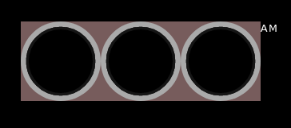

# css-svg-clock
## Analog-digital 3D clock using CSS/SVG/HTML/JS
<a name="top"></a>

The following tutorial helps to recreate the HH:MM:SS clock below, which then can be used on your next project page.


The basic idea come from [Online Tutorials](https://youtu.be/eoSfzVz9ur0) youtube page. I redesigned and added some extra features to the original work. Enjoy, and feel free to comment!

I'll try to follow the development - as it was happened at my desk - step by step, phase by phase with lot of comments, pictures, and code snippets. Some times I will give you some hints to be able to readjust or add more features to the design.

<a name="toc"></a>
<h2>Table of contents</h2>
<hr/>

[1 Preparations](#preparations)

[1.1 Generate HTML file](#genhtmlfile)

[1.1.1 Basic HTML 5 skeleton](#basicskeleton)

[1.2 HTML code of clock](#htmlfile)

[1.2.1 Add clock's container](#clockcontainer)

[1.2.2 Add clock's gauges and AM/PM indicator container](#gaugescontainer)

[1.2.3 Add circles to clock' face](#circles)

[1.3 The CSS file](#cssfile)

[1.3.1 Create base layout](#baselayout)
<hr/>

<a name="preparations"></a>
<h2>1 Preparations</h2>

First of all create a project folder, then create ***css*** subfolder in it. Touch *clock.css* in the subfolder **css**, then touch *clock.html* or *index.html* or whatever html file you prefer in the project's root directory. See directory structure below:

```bash
ls -Ra css-svg-clock
..
.
css/
css/clock.css
clock.html
```

<a name="genhtmlfile"></a>
<h3>1.1 Generate HTML file</h3>

<a name="basicskeleton"></a>
<h4>Step 1.1.1: create basic HTML 5 skeleton</h4>

First of all we create a basic HTML 5 file with all necessary elements in it.

```html
<!DOCTYPE html>
<html lang="en">
    <head>
        <title>CSS_SVG_Clock</title>
        <meta charset="UTF-8">
        <meta name="viewport" content="width=device-width, initial-scale=1">
        <link href="css/clock.css" rel="stylesheet">
    </head>
    <body>
        <!-- OUR CLOCK HTML CLODE GOES BETWEEN THESE COMMENT BLOCKS -->

        <!-- END OF CLOCK HTML CODES -->
    </body>
</html>
```

Every time I'm adding something into the clock's HTML code, they going to be placed between the two comment blocks.

[Back](#preparations) [Top](#top)

<a name="htmlfile"></a>
<h3>1.2 HTML code of clock</h3>

<a name="clockcontainer"></a>
<h4>Step 1.2.1: let's add div container for our clock</h4>

The ***div#time*** will contain our clock gauges and texts appear on our clock' face.

```html
        <!-- OUR CLOCK HTML CLODE GOES BETWEEN THESE COMMENT BLOCKS -->
        
        <div id="time">
        
        </div>
        
        <!-- END OF CLOCK HTML CODES -->
```

The ***#time*** div will contain our clock gauges and texts. This DOM element - with all its children - can be put into your page wherever you want - *and of course there's enough space to hold everything of the complete clock face*, all is up to you.

<a name="gaugescontainer"></a>
<h4>Step 1.2.2: add three container DIVs for the gauges and one for the AM/PM indicator of the clock.</h4>

Our clock consists of three circle gauges with text inside of each, and a label representing 12 hours clock AM or PM depending on the hours value after or before noon (*or midnight*).

```html
        <div id="time">
            <!-- HOURS -->
            <div class="gauge">

            </div>
            <!-- MINUTES -->
            <div class="gauge">

            </div>
            <!-- SECONDS -->
            <div class="gauge">

            </div>
            <!-- AM/PM -->
            <div class="ampm">AM</div>
        </div>
```

<a name="circles"></a>
<h4>Step 1.2.3: add circles to each gauges - not for AM/PM indicator</h4>

We define a container box to achieve the overlapping SVG layers and centered text values in the area of each circles.
The ***.circle*** classed DIVs will contain gauge's SVG elements needed to draw our clock faces. Later we add another layer on top of ***.circle***, which will detail the shining 3D effect. Plus a toplevel layer for the text representation of the current time value with the proper unit indication as well.

```html
        <div id="time">
            <!-- HOURS -->
            <div class="gauge">
                <div class="container">
                    <div class="circle">
                        <!-- This block will contain SVG circles -->
                        <svg>
                            <circle cx="60" cy="60" r="50" id="face"/>
                            <circle cx="60" cy="60" r="50" id="hh"/>
                        </svg>
                    </div>
                    <!-- Shining layer later... -->
                    <!-- Texta layer for time values and unit strings later... -->
                </div>
            </div>
            <!-- MINUTES -->
            <div class="gauge">
                <div class="container">
                    <div class="circle">
                    
                    </div>
                </div>
            </div>
            <!-- SECONDS -->
            <div class="gauge">
                <div class="container">
                    <div class="circle">
                    
                    </div>
                </div>
            </div>
            <!-- AM/PM -->
            <div class="ampm">AM</div>
        </div>
```

This is the time for checkout ***css/clock.css*** file and setup our page/clock layouts.

[Back](#htmlfile) [Top](#top)

<a name="cssfile"></a>
<h3>1.3 The CSS file</h3>

In this file we will control the display of the clock elements. Every DOM element will be packed into our **DIV#time** container. So, let's define it's style as follows...

<a name="baselayout"></a>
<h4>Step 1.3.1: we create our clock's base layout</h4>

```css
    /* Common part begins */
    * {
        margin: 0;
        padding: 0;
        box-sizing: border-box;
        border-collapse: collapse;
    }

    body {
        display: flex;
        align-items: center;
        justify-content: center;
        min-height: 100vh;
        font-family:Verdana, Geneva, Tahoma, sans-serif;
        font-size: 16px;
        font-weight: 500;
        letter-spacing: .1rem;
        background: rgb(0, 0, 0);
    }
    /* Common part ends */

    /* Clock specific part begins */
    #time {
        display: flex;
        /* gap: 10px; */
        color: white;
    }

    #time .gauge {
        position: relative;
        display: flex;
        width: 120px;
        height: 120px;
        align-items: center;
        justify-content: center;
        background: rgba(119, 92, 92, 1);
        /* background: rgba(119, 92, 92, 0); */
    }

    #time .gauge .container {
        position: absolute;
        width: 100%;
        height: 100%;
        display: flex;
        align-items: center;
        justify-content: center;
    }

    #time .gauge .container .circle {
        position: absolute;
        width: 100%;
        height: 100%;
        background: rgba(170, 170, 170, 1);
        /* background: rgba(170, 170, 170, 0); */
        border-radius: 50%;
        -webkit-border-radius: 50%;
        -moz-border-radius: 50%;
        -ms-border-radius: 50%;
        -o-border-radius: 50%;
        z-index: 10;
        stroke: rgb(21, 21, 21);
        stroke-width: 4px;
    }
    /* Clock specific part ends */
```

After this you should see the following page on your browser or preview window:



*To be continued...*

[Back](#cssfile) [Top](#top)