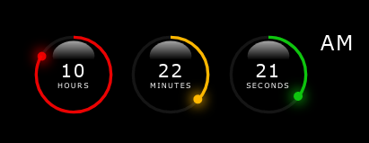

# css-svg-clock
## Analog-digital 3D clock using CSS/SVG/HTML/JS

The following tutorial helps to recreate the HH:MM:SS clock below, which then can be used on your next project page.

The basic idea come from [Online Tutorials](https://youtu.be/eoSfzVz9ur0) youtube page. I redesigned and added some extra features to the original work. Enjoy, and feel free to comment!

I'll try to follow the development - as it was happened at my desk - step by step, phase by phase with lot of comments, pictures, and code snippets. Some times I will give you some hints to be able to readjust or add more features to the design.

<h2>Table of contents</h2>

- [Preparations](#preparations)

- [The HTML file](#htmlfile)

- [The CSS file](#cssfile)

<h2>Preparations</h2>

[Back](#preparations) [Top](#top)

<h2>The HTML file</h2>

[Back](#htmlfile) [Top](#top)

<h2>The CSS file</h2>

[Back](#cssfile) [Top](#top)