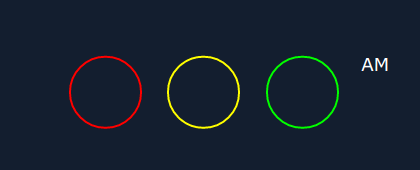

# css-svg-clock
## Analog-digital 3D clock using CSS/SVG/HTML/JS
<a name="top"></a>

The following tutorial helps to recreate the HH:MM:SS clock below, which then can be used on your next project page.


The basic idea come from [Online Tutorials](https://youtu.be/eoSfzVz9ur0) youtube page. I redesigned and added some extra features to the original work. Enjoy, and feel free to comment!

I'll try to follow the development - as it was happened at my desk - step by step, phase by phase with lot of comments, pictures, and code snippets. Some times I will give you some hints to be able to readjust or add more features to the design.

<a name="toc"></a>
<h2>Table of contents</h2>
<hr/>

[1 Preparations](#preparations)

[1.1 Generate HTML file](#genhtmlfile)

[1.1.1 Basic HTML 5 skeleton](#basicskeleton)

[1.2 HTML code of clock](#htmlfile)

[1.2.1 Add clock's container](#clockcontainer)

[1.2.2 Add clock's gauges and AM/PM indicator container](#gaugescontainer)

[1.2.3 Add circles to clock' face](#circles)

[1.3 The CSS file](#cssfile)

[1.3.1 Create base layout](#baselayout)
<hr/>

<a name="preparations"></a>
<h2>1 Preparations</h2>

First of all create a project folder, then create ***css*** subfolder in it. Touch *clock.css* in the subfolder **css**, then touch *clock.html* or *index.html* or whatever html file you prefer in the project's root directory. See directory structure below:

```bash
ls -Ra css-svg-clock
..
.
css/
css/clock.css
clock.html
```

<a name="genhtmlfile"></a>
<h3>1.1 Generate HTML file</h3>

<a name="basicskeleton"></a>
<h4>Step 1.1.1: create basic HTML 5 skeleton</h4>

First of all we create a basic HTML 5 file with all necessary elements in it.

```html
<!DOCTYPE html>
<html lang="en">
    <head>
        <title></title>
        <meta charset="UTF-8">
        <meta name="viewport" content="width=device-width, initial-scale=1">
        <link href="css/clock.css" rel="stylesheet">
    </head>
    <body>
        <!-- OUR CLOCK HTML CLODE GOES BETWEEN THESE COMMENT BLOCKS -->

        <!-- END OF CLOCK HTML CODES -->
    </body>
</html>
```

Every time I'm adding something into the clock's HTML code, they going to be placed between the two comment blocks.

[Back](#preparations) [Top](#top)

<a name="htmlfile"></a>
<h3>1.2 HTML code of clock</h3>

<a name="clockcontainer"></a>
<h4>Step 1.2.1: let's add div container for our clock</h4>

The ***div#time*** will contain our clock gauges and texts appear on our clock' face.

```html
        <!-- OUR CLOCK HTML CLODE GOES BETWEEN THESE COMMENT BLOCKS -->
        
        <div id="time">
        
        </div>
        
        <!-- END OF CLOCK HTML CODES -->
```

The ***#time*** div will contain our clock gauges and texts. This DOM element - with all its children - can be put into your page wherever you want - *and of course there's enough space to hold everything of the complete clock face*, all is up to you.

<a name="gaugescontainer"></a>
<h4>Step 1.2.2: add three container DIVs for the gauges and one for the AM/PM indicator of the clock.</h4>

Our clock consists of three circle gauges with text inside of each, and a label representing 12 hours clock AM or PM depending on the hours value after or before noon (*or midnight*).

```html
        <div id="time">
            <!-- HOURS -->
            <div class="clock">

            </div>
            <!-- MINUTES -->
            <div class="clock">

            </div>
            <!-- SECONDS -->
            <div class="clock">

            </div>
            <!-- AM/PM -->
            <div class="clock">

            </div>

        </div>
```

<a name="circles"></a>
<h4>Step 1.2.3: add circles to each gauges - not for AM/PM indicator</h4>

The **circle** classed DIVs will contain gauge's SVG elements needed to draw our clock faces.

```html
        <div id="time">

            <!-- HOURS -->
            <div class="clock">
                <!-- CIRCLES FOR HOURS -->
                <div class="circle" style="--color: #f00;">
                    <svg>
                        <circle cx="40" cy="40" r="36"/>
                        <circle cx="40" cy="40" r="36" id="hh"/>
                    </svg>
                </div>
            </div>

            <!-- MINUTES -->
            <div class="clock">
                <!-- CIRCLES FOR MINUTES -->
                <div class="circle" style="--color: #ff0;">
                    <svg>
                        <circle cx="40" cy="40" r="36"/>
                        <circle cx="40" cy="40" r="36" id="mm"/>
                    </svg>
                </div>
            </div>
            
            <!-- SECONDS -->
            <div class="clock">
                <!-- CIRCLES FOR SECONDS -->
                <div class="circle" style="--color: #0f0;">
                    <svg>
                        <circle cx="40" cy="40" r="36"/>
                        <circle cx="40" cy="40" r="36" id="ss"/>
                    </svg>
                </div>
            </div>

            <!-- AM/PM -->
            <div class="clock">
                <div class="ampm">
                    <div id="ap">AM</div>
                </div>
            </div>

        </div>
```

This is the time for checkout ***css/clock.css*** file and setup our page/clock layouts.

[Back](#htmlfile) [Top](#top)

<a name="cssfile"></a>
<h3>1.3 The CSS file</h3>

In this file we will control the display of the clock elements. Every DOM element will be packed into our **DIV#time** container. So, let's define it's style as follows...

<a name="baselayout"></a>
<h4>Step 1.3.1: we create our clock's base layout</h4>

```css
    /* Common part begins */
    * {
        /* simple reset... */
        margin: 0;
        padding: 0;
        box-sizing: border-box;
    }
    body {
        /* we will position our clock container to the center of the demo page */
        display: flex;
        justify-content: center;
        align-items: center;
        min-height: 100vh;
        font-family:Verdana, Geneva, Tahoma, sans-serif;
        background: rgba(0,0,0,1);
    }
    /* Common part ends */

    /* Clock specific part begins */
    #time {
        display: flex;        /* we define 100px artificial gaps between circles because we later would overlap each */
        gap: 100px;           /* circles with a shining layer, therefore the container should be positioned absolute */ 
        width: auto;          /* as a result each circle will overlap each other - avoid this we add gap between each */
    }                         /* circles a width and some additional gap, in this case 80px + 20px = 100px */

    #time .clock {
        position: relative;
        display: flex;
        justify-content: center;
        align-items: center;
        color: #fff;
    }

    #time .clock .circle,
    #time .clock .shine {
        width: 80px;                          /* set the dimension of each gauge container */
        height: 80px;
    }

    #time .clock svg {
        width: 100%;                          /* reduce SVG element size to fit in parent box */
        height: 100%;
    }

    #time .clock .circle svg circle {
        fill: transparent;                    /* we left transparent the gauge faces, but later they can be colorized... */
    }

    #time .clock .circle svg {
        stroke: rgb(26, 26, 26);              /* add some natural color for the stroke path when it was not redrawn according to the current time values */
        stroke-width: 2px;                    /* add some thickness for the stroke */
        transform: rotate(270deg);            /* we're going to rotate SVG elemtn - contains our circles CW to set path's starting location at top - or North */
        -webkit-transform: rotate(270deg);    /* if we were skip this step, the clock would show whole ours at three oclock - on the right from the center */
        -moz-transform: rotate(270deg);       /* do not rotate CCW 90 degrees, because the direction will turn as well to CCW... which would be starnge */
        -ms-transform: rotate(270deg);
        -o-transform: rotate(270deg);
    }

    #time .clock .circle svg circle:nth-child(2) {
        stroke: var(--color);                 /* the first circle will be drawn with it's default attributes, but the second one will be colored and dashOffsetted according to the current time values */
        stroke-dasharray: 226;                /* the value of dash array would be calculated as follows: circle' radius x 2 x Math.PI and round to the nearest integer */
    }                                         /* in our case: r = 36, 2 x 36 x Math.PI ~ 226.19 => after rounding the result will be 226 */
                                              /* this value will cover the full length of path of the circle, so if we want to draw only a part of it, then we use a calculation below: */

                                              /* if we deal with hour gauge:                                                   */
                                              /* let dashOffset = Math.ceil(2 * radius * Math.PI);                             */
                                              /* hourCircle.style.strokeDashoffset = dashOffset - (dashOffset * hours) / 12;   */
                                              /* minuteCircle.style.strokeDashoffset = dashOffset - (dashOffset * hours) / 60; */
                                              /* secondCircle.style.strokeDashoffset = dashOffset - (dashOffset * hours) / 60; */


    #time .clock div {
        position: absolute;
    }

    #time .clock .ampm {
        transform: translateY(-40px) translateX(-40px);
        -webkit-transform: translateY(-40px) translateX(-40px);
        -moz-transform: translateY(-40px) translateX(-40px);
        -ms-transform: translateY(-40px) translateX(-40px);
        -o-transform: translateY(-40px) translateX(-40px);
        font-size: 1.15em;
        font-weight: 300;
        text-transform: uppercase;
    }
    /* Clock specific part ends */
```

After this you should see the following page on your browser or preview window:



*To be continued...*

[Back](#cssfile) [Top](#top)